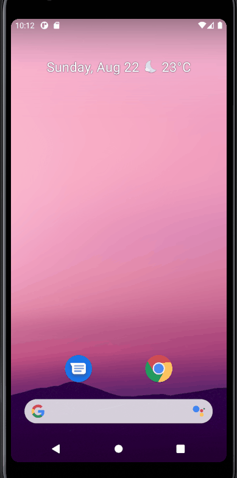
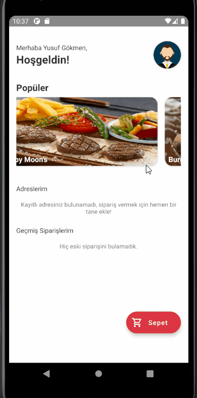
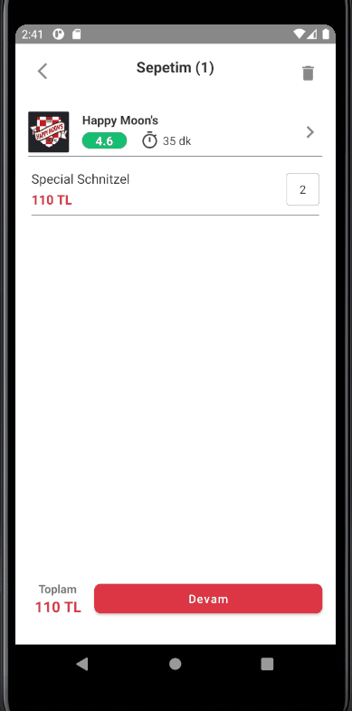
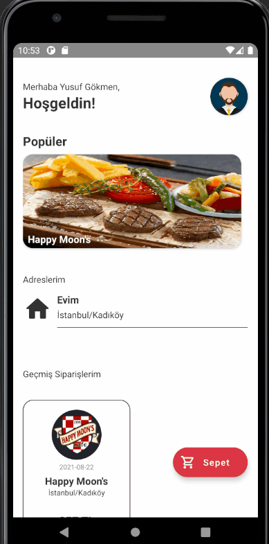
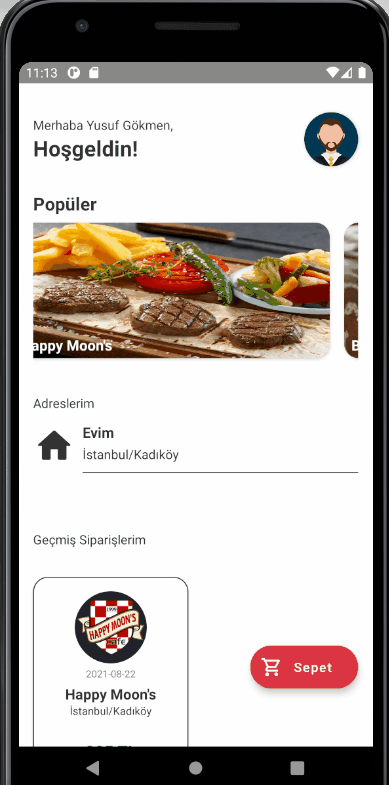
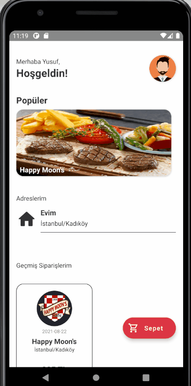
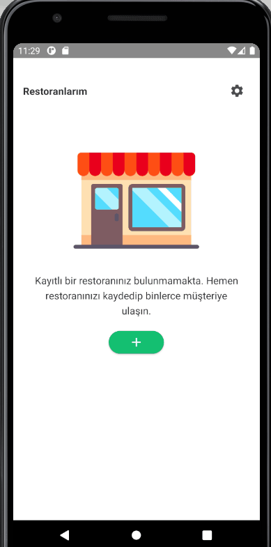
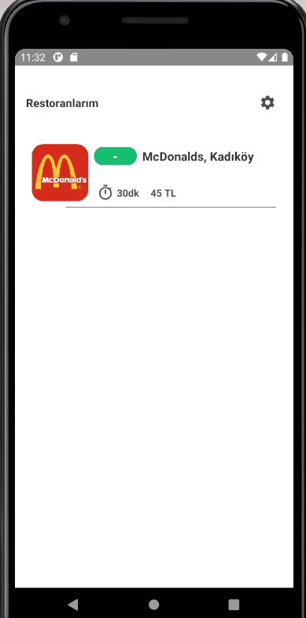
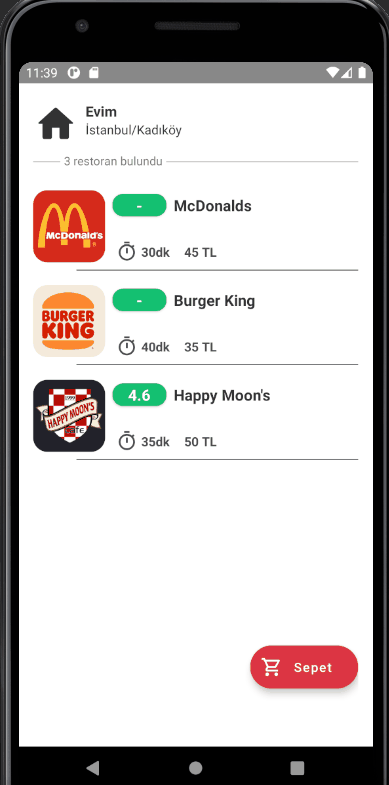
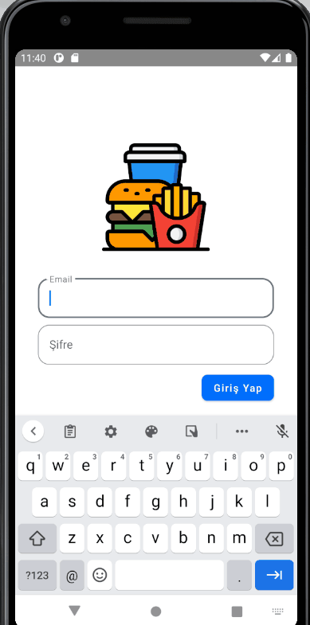

# FoodOrder
Food ordering application with Kotlin for Yemeksepeti Android Bootcamp.

## Technologies and Libraries
- MVVM
- Dagger Hilt
- Coroutines
- Retrofit2
- Room
- ViewBinding
- Navigation
- SafeArgs
- OkHttp
- Glide
- Gson
- Lottie

## Back-end
I developed a RESTful API for application back-end with Node.js. It's live on [Heroku](https://www.heroku.com/), can look to the [repository](https://github.com/yusufarisoy/yemeksepeti-bootcamp-final-project-server) for more details.
```
https://yemeksepeti-bootcamp-project.herokuapp.com/
```

## App Content - User Account
#### Splash, OnBoarding, Login and Register
- Authentication provided with **JWT**
- JWT token saved in **Shared Preferences**


#### Basket, Foods and Popular Restaurant
- Cart (or basket) handled with **Room** and **Shared View Model**
- Check for session in splash
- Can't add foods from different restaurants, if user wants can clear other foods and add the new one


#### Profile, Addresses and Restaurant list of address


#### Cart and Order Confirm


#### Order History, Order Review and Change Password
- Regex used for password validation
- Can't rate the already rated orders


#### Edit Profile


## Restaurant Owner Account
#### Register, Update Profile and Change Password


#### Add and Edit Restaurant


#### Add and Update Food


#### Order from new restaurant to new address


#### Confirm Order
